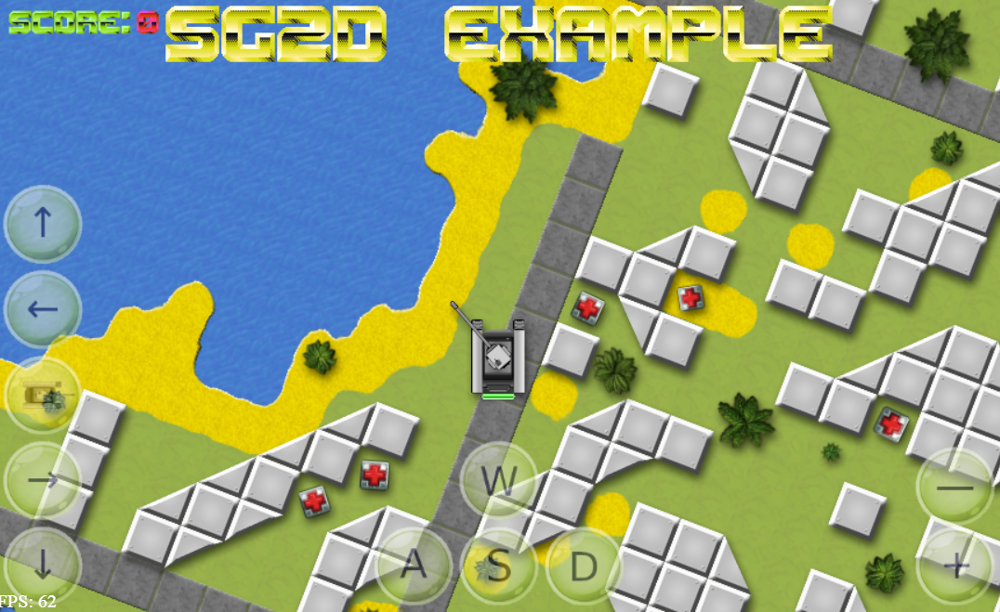

# SG2D

SG2D - 2D игровой движок на PixiJS и MatterJS (физический движок), оптимизированный для больших карт. Используется матричная кластеризация тайлов. Написан на ES6. Поддерживается последними версиями браузеров Chrome, Opera, Mozilla, Yandex.

* SG2D на GitHub'е: [https://github.com/VediX/sg2d.github.io](https://github.com/VediX/sg2d.github.io)
* Документация по API: [https://github.com/VediX/sg2d.github.io/wiki/SG2D-API](https://github.com/VediX/sg2d.github.io/wiki/SG2D-API)

**Готовые сборки (v 1.0.0):**

* [sg2d.js (187KB)](https://raw.githubusercontent.com/VediX/sg2d.github.io/main/build/sg2d.js)
* [sg2d.min.js (94KB)](https://raw.githubusercontent.com/VediX/sg2d.github.io/main/build/sg2d.min.js)

**Плагины:**

* [sg2d-transitions.js](https://raw.githubusercontent.com/VediX/sg2d.github.io/main/build/plugins/sg2d-transitions.js)

## Подключение

Пример HTML-кода:

```html
<script src="sg2d/sg2d.js" type="text/javascript"></script>
```

**Подключение плагинов:**

Плагин подключается в SG2D-приложении следующим образом:

```js
let sg2dApp =  new SG2D.Application({
	...
	plugins: ["sg2d-transitions", ...]
});
```

Если требуется использовать функционал плагина, его нужно подключить с помощью ES6 import'а, например:

```js
import SG2DTransitions from "./sg2d/plugins/sg2d-transitions.js";
...
// Smooth transitions between different land types (use plugin)
SG2DTransitions.ready(()=>{
	SG2DTransitions.run(sg2dApp.clusters);
});
...
```

## Примеры

Пример реализации игры на движке SG2D с плагином SG2DTransitions: [https://demo.sg2d.ru/](https://demo.sg2d.ru/)

Управление: W и S - двигаться, A и D - повернуть, Shift + W - ускоритель движения, левая кнопка мыши - выстрел, правая кнопка мыши - свободное перемещение по карте, скроллинг - масштабирование карты



## Лицензия

SG2D is licensed under [The MIT License (MIT)](https://opensource.org/licenses/MIT)  
Copyright (c) 2021 Ilya Kalashnikov

This license is also supplied with the release and source code.
As stated in the license, absolutely no warranty is provided.